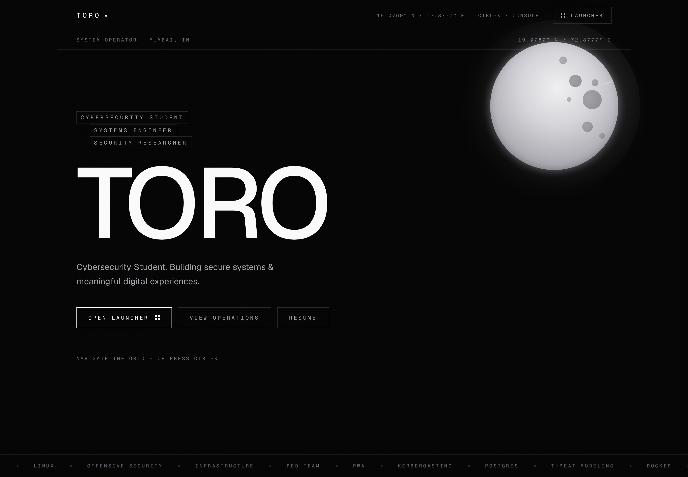
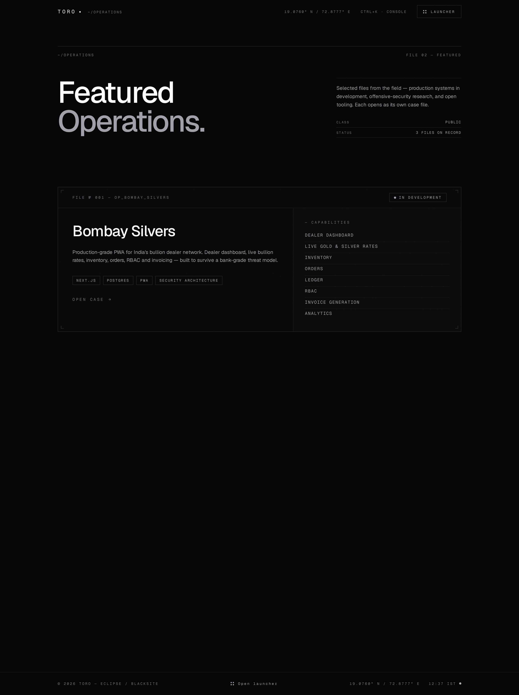

# ECLIPSE / BLACKSITE — TORO

> A **portfolio OS** — a multi-page, application-style portfolio for a
> cybersecurity student and systems engineer. Dossier-grade, editorial, and
> aggressively monochrome.

Monochrome as an identity, not a theme. Brutalist structure with editorial
typography. A classified intelligence file masquerading as a luxury website —
no green text, no matrix rain, no rgb glow.

The navigation mirrors an operating system: a sparse desktop home, a
**launcher grid** of dedicated pages, and a command palette. Every page is its
own route. Nothing scrolls forever.





## Stack

- **[Next.js 15](https://nextjs.org)** (App Router) — static-first, per-route SSG
- **TypeScript** — strict mode
- **[Tailwind CSS v4](https://tailwindcss.com)** — CSS-first tokens
- **[Framer Motion](https://motion.dev)** — restrained route + UI transitions
- **[Lenis](https://github.com/darkroomengineering/lenis)** — buttery smooth scrolling
- **[Geist](https://vercel.com/font)** — Geist Sans + Geist Mono (self-hosted via `next/font`)
- **Lucide** — minimal iconography

## Identity

```
Background   #050505
Surface      #090909
Border       #27272A
Primary      #FAFAFA
Secondary    #A1A1AA
Muted        #71717A
```

No accent color. The absence of color is the identity.

## Applications

Each route is a self-contained page — opened from the launcher grid, navigable
by command palette, and persistent nav/footer chrome on every route.

| Route | Application | Index |
| --- | --- | --- |
| `/` | **Operator** — desktop home, starry night, controls | `00` |
| `/identity` | **Identity** — profile, base, focus | `01` |
| `/operations` | **Operations** — classified dossier cards | `02` |
| `/arsenal` | **Arsenal** — tooling grid, no progress bars | `03` |
| `/orbit` | **Orbit** — hover-expanding trajectory | `04` |
| `/archive` | **Archive** — photography / library / journal | `05` |
| `/contact` | **Contact** — quiet channels | `06` |
| `/resume` | **Resume** — utility, print-ready | `UT` |
| `/operations/:slug` | Case files — per-operation detail pages | — |

## Navigation

- **Launcher** — a full-screen application grid. Open it from the nav bar, the
  footer, or the desktop home.
- **Terminal** — a working Linux shell. Press `Ctrl+K` (or `Cmd+K`), or click
  the `term` icon in the nav. Real commands, a virtual filesystem, tab
  completion, and history.

```
> whoami      → toro
> pwd         → /home/toro
> ls          → identity/  operations/  arsenal/  orbit/  archive/  contact/ ...
> cat ~/readme.txt
> cd identity → step into a directory
> open arsenal → navigate to the live page
> fetch       → system info
> help        → all commands
> clear       → reset screen
> exit        → close terminal
```

- Persistent chrome — top navigation (logo, coordinates, launcher) and a
  status-bar footer with IST clock render on every route. Route changes animate
  with a restrained fade + rise.

## Getting Started

```bash
npm install
npm run dev       # http://localhost:3000
```

```bash
npm run build     # production build (all routes SSG)
npm run start     # serve production build
npm run lint      # eslint
```

## Customization

Your content lives in **`lib/data.ts`** — single source of truth:

- Site identity, coordinates, timezone, GitHub / LinkedIn / Email / Resume URLs
- The application grid (`APPS`, `UTILITIES`) and per-route metadata
- Featured Operations, Arsenal, Orbit nodes, Archive collections
- The terminal's virtual filesystem (files, folder names, file contents)

Edit the data, keep the silence. Swap placeholder imagery inside `public/img/`
(`mumbai.svg`, `brutalist.svg`, `editorial.svg`) for real work when ready.

Design tokens are in `app/globals.css` (`@theme`). Routes live in `app/` —
one folder per application. Shared chrome is in `components/` (nav, footer,
launcher, terminal, cursor).

## Performance

- Static prerendering for every route — zero per-request work
- 0 CLS, sub-300 ms LCP in testing
- Self-hosted fonts — no external requests
- `prefers-reduced-motion` respected end to end

## License

© 2026 TORO — all rights reserved. The classification is yours to lift; the
code is this operator's.